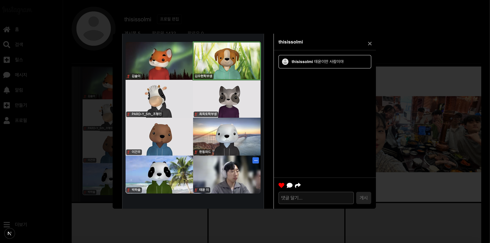
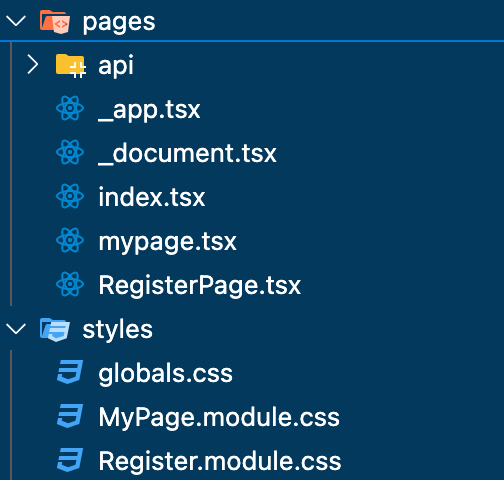
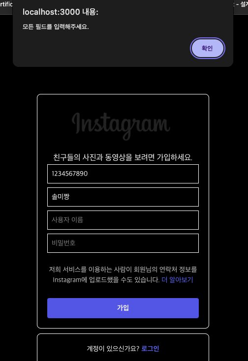
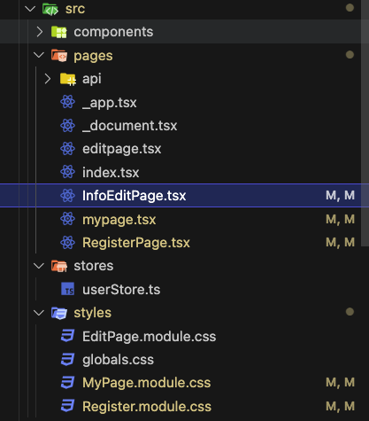

파드 3차 과제
4월 11일 금요일까지

목표

- Next.js에서의 **컴포넌트 분리 및 모달 관리 구조**를 이해하고 구현한다.
- **`useState`, `useEffect`, `event`** 중심의 React Hook을 활용하여 UI 상태를 반응형으로 관리한다.

 like 상태 관리 (이벤트 기반) 
 댓글 기능 추가 

스크린샷 

폴더 구조 

 

파드 4차 과제
4월 18일 금요일까지 

목표
- `Zustand`를 활용해 **사용자 정보의 전역 상태 관리**를 구현한다.
- `Media Query` 또는 `Tailwind CSS`를 사용하여 **반응형 웹 페이지**를 제작한다.
- **컴포넌트 최적화**와 폴더 구조 설계를 통해 유지보수 가능한 코드를 작성한다.

추가적으로 챌린지 모드는 아니지만 구현한 사항 
-registerpage에서 데이터를 입력 않고 로그인 버튼 누르면 다음 페이지 mypage로 넘어가지 않게 함 (필수 값 설정)

기존 UserState -> userStore로 상태관리 변경 
RegisterPage에서 입력한 Name을 mypage에서 프로필 이름으로 값 가지고 옴

실행결과 :

파일 경로 : 
